# ADR 001 : conserver les réservations annulées

Date : 10 septembre 2026. Statut : accepté pour la démonstration pédagogique. Portée : règles de réservation du kit en mémoire, sans base de données déployée.

## Contexte

L’association fictive veut retrouver qu’une personne a déjà réservé une séance, même après annulation. Une personne peut réserver plusieurs séances, mais une seule réservation par couple personne-séance est conservée. Le kit doit rendre cette règle observable avec quelques exemples.

La conservation d’un enregistrement avec son statut courant permet de retrouver une annulation. Elle ne constitue pas un journal complet de tous les changements.

## Options examinées

| Option | Conséquence |
| --- | --- |
| Supprimer la réservation annulée | Libère la place, mais perd la trace de la réservation dans ce modèle |
| Conserver la réservation et autoriser une seconde création | Conserve davantage d’occurrences, mais change la règle d’unicité retenue |
| Conserver la réservation et permettre sa réactivation | Nécessite de définir les permissions et le contrôle de capacité lors du retour |
| Conserver la réservation sans proposer de réactivation | Rend les deux états et le refus de doublon explicites dans cette première démonstration |

## Décision

L’annulation remplace le statut confirmé par annulé et conserve la réservation dans la liste. Seules les réservations confirmées occupent une place. Une seconde création pour le même couple personne-séance est refusée, quel que soit le statut de la précédente.

[Source Mermaid de cet état historique](../visuels/adr-annulation.mmd).

## Conséquences

Une place annulée devient disponible pour une autre personne. La personne qui a annulé ne peut pas revenir par une nouvelle création. Cette restriction doit apparaître dans l’aide et dans le message expliqué par le support.

Une demande future de réactivation devra préciser la disponibilité, les permissions et le maintien de l’identifiant. Si elle est acceptée, une nouvelle décision remplacera celle-ci. Cet ADR gardera la trace du choix initial.

Dans une application persistante, il faudra définir la durée de conservation, la suppression des données personnelles et les contraintes de base appropriées. Le kit ne choisit pas de politique de conservation réelle et n’implémente aucune migration SQL.

## Vérifier le choix

- [Scénarios métier](../../demo/features/reservations.feature) : refus après annulation et place libérée pour une autre personne.
- [Tests de la règle](../../demo/tests/reservations.test.mjs).
- [Implémentation et annotations](../../demo/src/reservations.mjs).

Lancer npm test et npm run test:bdd depuis la racine du kit. Les tests rendent observable le comportement retenu. Leur réussite ne décide pas si la restriction convient encore aux utilisateurs.
